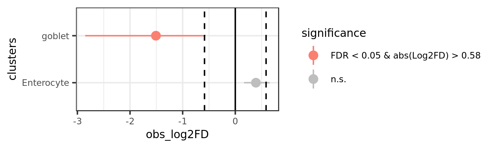

# Single Cell Proportion Test

This R library facilitates the analysis of the difference between the proprotion of cells
in clusters between two scRNA-seq samples.
A permutation test is used to calculate a p-value for each cluster,
and a confidence interval for the magnitude difference is returned via bootstrapping.
There is also a function to generate a point range plot to display the results. If you 
are working with an AnnData object you may consider the 
[python implementation](https://github.com/SamuelAMiller1/py-scProportionTest/tree/main).

## Library Installation

Use devtools to install the R library.

```
devtools::install_github("rpolicastro/scProportionTest")
```

## Getting Started

This library pulls the meta-data from a seurat object for its analysis.
This means that you must first process your data in seurat.
Seurat has various [vignettes](https://satijalab.org/seurat/vignettes.html) to get you started.

Once you have a seurat object, you are ready to get started.
We'll first load some example data for the vignette, and create the analysis object.

```
library("scProportionTest")

seurat_data <- system.file("extdata", "example_data.RDS", package = "scProportionTest")
seurat_data <- readRDS(seurat_data)

prop_test <- sc_utils(seurat_data)
```

Once the object is created, the permutation testing and bootstrapping can be run.

```
prop_test <- permutation_test(
	prop_test, cluster_identity = "custom_clusters",
	sample_1 = "HT29_EV", sample_2 = "HT29_LSD1_KD",
	sample_identity = "orig.ident"
)
```

A point-range plot of the results can then be created.

```
permutation_plot(prop_test)
```



## Citing

Miller SA, Policastro RA, Sriramkumar S, Lai T, Huntington TD, Ladaika CA, Kim D, Hao C, Zentner GE, O'Hagan HM. LSD1 and Aberrant DNA Methylation Mediate Persistence of Enteroendocrine Progenitors That Support BRAF-Mutant Colorectal Cancer. Cancer Res. 2021 Jul 15;81(14):3791-3805. doi: 10.1158/0008-5472.CAN-20-3562. Epub 2021 May 25. PMID: 34035083; PMCID: PMC8513805.
